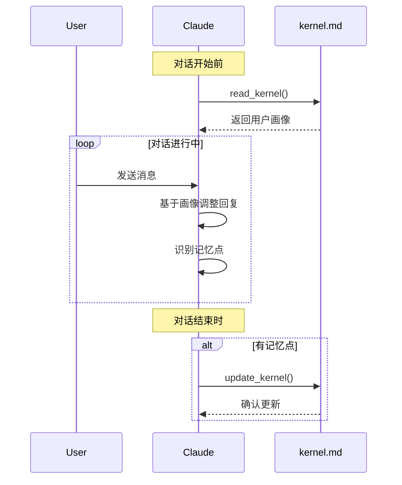

# 长期记忆方案设计

基于 CLAUDE.md 机制和 Skills 的用户长期记忆系统。

## 核心思想

不是让系统"偷偷"记录用户行为，而是**让 Claude 主动参与记忆管理**。

- 每次对话前，Claude 读取用户的 `kernel.md`
- 对话中，Claude 识别值得记住的信息
- 对话后，Claude 主动更新 `kernel.md`

## 文件结构

```
memory/
├── {userId}/
│   ├── kernel.md              # 用户内核（由 Claude 维护）
│   ├── conversations/         # 近期对话（自动归档）
│   └── working/               # 工作记忆（临时）
└── .template.md               # 内核模板
```

## kernel.md 结构

```markdown
# User Kernel: {userId}

> 最后更新: 2025-02-25 16:30:00
> 由 Claude 自动维护

## 基础画像

- **身份**: 全栈工程师
- **专业领域**: TypeScript, React, Node.js
- **工作模式**: 偏好简洁代码，重视类型安全

## 日常习惯

- 喜欢使用 Bun 而非 npm
- 习惯先写测试再实现
- 偏好函数式编程风格
- 每天上午 9-11 点最高效

## 技能标签

- **精通**: TypeScript, React, Fastify
- **熟练**: Python, PostgreSQL
- **学习ing**: Rust, ML

## 偏好设置

- 代码风格: 2空格缩进，单引号
- 通信方式: 直接、简洁
- 反馈风格: 先给结论再给解释

## 重要上下文

- 当前项目: cc-agents（HTTP Claude 服务）
- 技术债务: 需要重构旧项目的认证模块
- 近期目标: 完成长期记忆功能

## 关系网络

- 常协作: user-b（前端专家）
- 导师: user-c（架构师）
```

## 集成方案

### 1. System Prompt 注入

在每次对话开始时，将 kernel.md 注入到 system prompt:

```typescript
const systemPrompt = `
You are Claude, an AI assistant.

## 关于当前用户

${await readUserKernel(userId)}

## 记忆管理指令

在对话过程中，如果你发现以下类型的信息，请主动更新用户内核:
- 用户的习惯、偏好变化
- 新技能或兴趣
- 重要项目或目标
- 人际关系变化

使用提供的工具 update_kernel 来更新。
`;
```

### 2. MCP Tools

```typescript
// 定义 memory skill
tools: {
  read_kernel: {
    description: '读取当前用户的内核文件',
    input: { userId: string },
    output: { content: string }
  },
  update_kernel: {
    description: '更新用户内核的特定部分',
    input: {
      userId: string,
      section: string,      // 如 'habits', 'skills', 'preferences'
      content: string       // Markdown 内容
    }
  },
  append_conversation: {
    description: '将当前对话追加到历史',
    input: {
      userId: string,
      sessionId: string,
      summary: string       // Claude 生成的对话摘要
    }
  }
}
```

### 3. 提示词工程

**Memory-Aware System Prompt**:

```markdown
# 长期记忆管理指南

你是 Claude，拥有长期记忆能力。每次对话前，你会看到用户的内核文件。

## 你的记忆职责

1. **读取**: 对话开始前，kernel.md 已加载到上下文
2. **使用**: 基于用户画像调整回复风格
3. **识别**: 在对话中识别值得记住的信息:
   - 习惯变化: "我以后都用 Bun 了"
   - 新技能: "最近在学 Rust"
   - 偏好: "我喜欢简洁的代码"
   - 目标: "下个月要发布 MVP"
   - 关系: "我和 user-b 经常合作"
4. **更新**: 对话结束时，主动更新内核文件

## 更新规则

- 只记录**持久的**信息，临时信息忽略
- 用**用户的原话**或**简洁总结**
- 保持 kernel.md 的结构
- 不要删除已有信息，用删除线标注过时内容

## 示例

用户说: "我习惯早上 9 点开会"
→ 更新到: **日常习惯** 部分

用户说: "刚学会用 Zustand 替代 Redux"
→ 更新到: **技能标签** 部分
```

## 工作流程



## 优势

1. **透明**: 用户可以看到 Claude 记住了什么
2. **可控**: 用户可以直接编辑 kernel.md 修正
3. **简单**: 纯文本，无需数据库
4. **智能**: Claude 参与记忆筛选，质量更高
5. **可移植**: Markdown 文件随时迁移

## 实现要点

### 内核文件自动创建

首次使用时，基于模板创建:

```typescript
async function ensureKernel(userId: string) {
  const kernelPath = `memory/${userId}/kernel.md`;
  if (!exists(kernelPath)) {
    const template = await readFile('.template.md');
    await writeFile(kernelPath, template.replace('{userId}', userId));
  }
}
```

### 对话归档

每天结束时，Claude 生成摘要:

```markdown
# 2025-02-25 对话摘要

## Session-1 (10:00-10:30)
- 主题: 设计长期记忆方案
- 关键决策: 使用 Markdown 而非数据库
- 产出: 架构文档

## Session-2 (14:00-14:45)  
- 主题: 实现 MemoryManager
- 新增记忆:
  - 用户偏好: "不要数据库，用文件"
```

## 与现有系统集成

在 `ClaudeSession` 中集成:

```typescript
class ClaudeSession {
  constructor(options) {
    // ... 现有代码
    
    // 加载用户内核到 system prompt
    this.loadUserKernel();
  }
  
  async loadUserKernel() {
    const kernel = await memoryManager.readKernel(this.userId);
    this.systemPrompt += `\n\n## 用户画像\n\n${kernel}`;
  }
  
  async sendMessage(content) {
    // ... 发送消息
    
    // 检测是否需要更新内核
    if (this.shouldUpdateKernel(content, response)) {
      await memoryManager.updateKernel(this.userId, /* ... */);
    }
  }
}
```

## 扩展: AI 自动总结

可以配置一个定时任务，让 Claude 定期:
1. 读取所有对话摘要
2. 归纳出模式和趋势
3. 更新 kernel.md 的深层洞察

```typescript
// 每晚 12 点执行
cron.schedule('0 0 * * *', async () => {
  for (const userId of activeUsers) {
    await generateDeepInsights(userId);
  }
});
```
