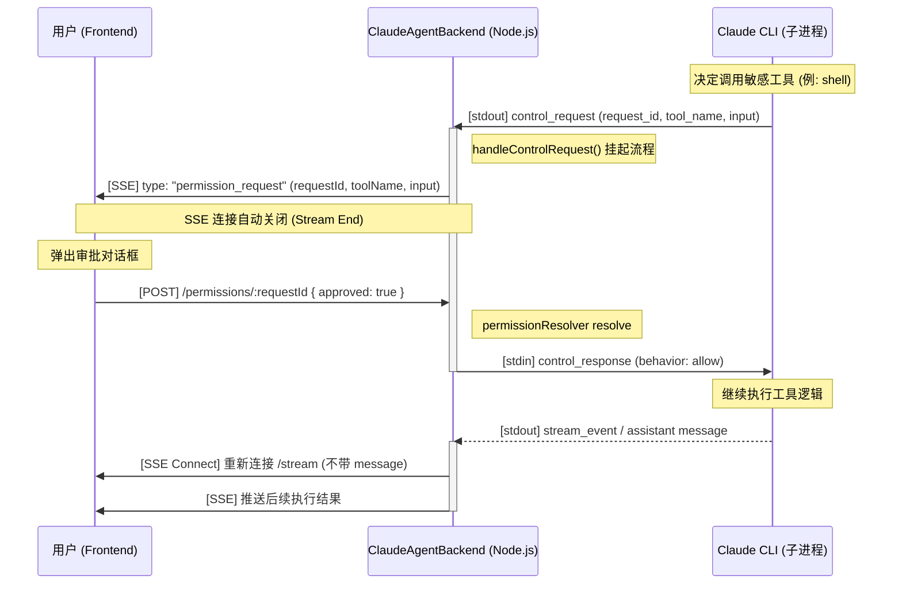

# 工具权限申请时序图与流程说明

本文档详细描述了 Claude CLI、后端（cc-portal）与前端用户之间，关于工具调用权限审批（Permission Request）的完整交互流程。

## 1. 交互时序图

## 2. 核心流程步骤

1.  **触发 (Trigger)**：Claude 在思考过程中需要调用工具。由于启动时带了 `--permission-prompt-tool stdio`，它不会直接执行，而是向 stdout 发送一个 `control_request` 并进入阻塞等待。
2.  **后端拦截 (Interception)**：`ClaudeAgentBackend` 的读取循环解析到该请求，调用 `handleControlRequest`。
3.  **流式通知 (SSE Notification)**：
    *   后端触发 `permissionRequest` 事件。
    *   正在运行的 `queryStream` 监听到事件，生成一个 `type: "permission_request"` 的 chunk 推给前端。
    *   **关键点**：推完该 chunk 后，后端会主动结束当前的 SSE 输出，前端检测到流结束后展示审批 UI。
4.  **用户审批 (User Approval)**：用户在 UI 上点击允许或拒绝。前端发送 POST 请求到服务器。
5.  **恢复执行 (Resume)**：
    *   后端拿到审批结果，通过 stdin 回写 `control_response`。
    *   Claude CLI 收到信号后恢复运行。
6.  **流式续接 (Reconnect)**：前端在审批 POST 成功后，需要**重新连接** `/stream` 接口（且不带 `message` 参数），从而接收工具执行后的后续输出。

## 3. 实现要点 (内存泄漏防护)

在 `queryStream` 的实现中，为了防止多次审批导致监听器堆积，采取了以下措施：

*   **唯一监听器**：在 `try...finally` 块外声明监听函数 `onPermission`。
*   **及时清理**：在 `finally` 块中使用 `this.off('permissionRequest', onPermission)`。
*   **单次触发**：使用 `permissionPromise` 配合 `this.once`，确保每个流生命周期内对权限信号的捕捉是可控且唯一的。

## 4. 相关文档

*   [control_request / control_response 协议详情](./CONTROL-REQUEST-RESPONSE-FLOW.md)
*   [HTTP 下工具审批设计](./HTTP-TOOL-APPROVAL-DESIGN.md)
